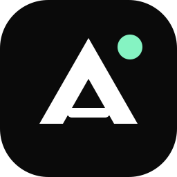
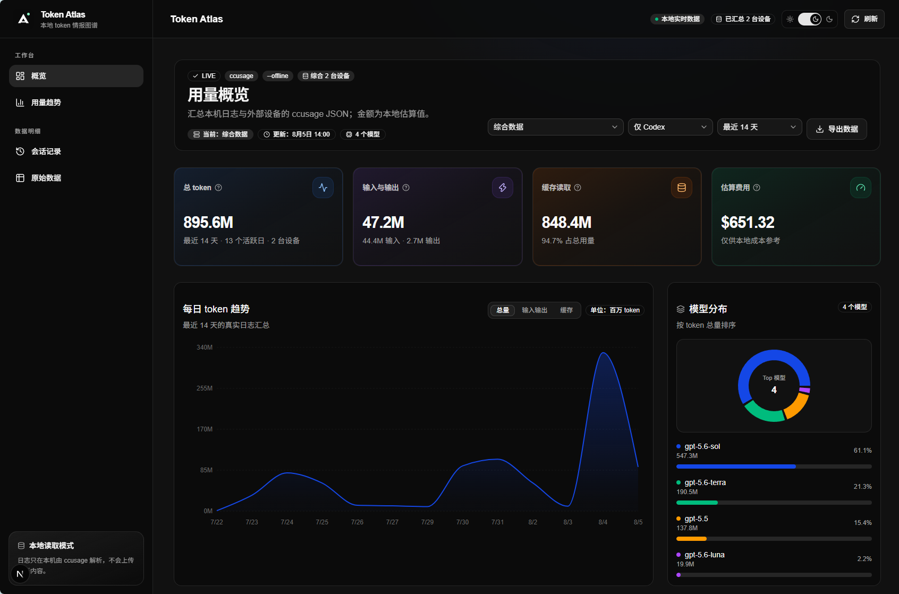
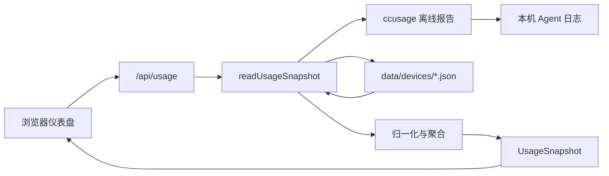

# Token Atlas

<p align="center">
  
</p>

<p align="center">
  一个以隐私为先的本地仪表盘：把 ccusage 可读取的 AI 编程 Agent 用量、缓存、模型与多设备汇总放到同一视图中。
</p>

<p align="center">
  <a href="https://github.com/DonsonHH/Token-Atlas/actions"></a>
  
  
  
</p>



## 它解决什么问题

Token Atlas 只在你的机器上读取 ccusage 的离线汇总。它适合同时使用多种 Agent、在 Windows 与 Ubuntu / Jetson 之间切换，或希望长期观察 token 规模、缓存复用和模型结构的个人开发者。

它不上传会话正文，也不需要 API Key。浏览器仅请求本地的 `/api/usage`；外部设备只通过你主动复制或导入的 JSON 汇总参与统计。

| 你想知道 | Token Atlas 提供的答案 |
| --- | --- |
| 总共用了多少？ | 精确 token 数字与紧凑单位显示可一键切换，附带活跃日与设备覆盖范围。 |
| 用量何时发生变化？ | 同一张日、周、月趋势图，可按总量、请求、缓存或模型维度查看。 |
| 哪个模型或设备贡献最多？ | 模型排行、综合设备筛选与外部设备导入状态。 |
| 本机会话主要来自哪里？ | 本地会话规模、项目负载与最后活跃时间分布。 |

## 支持的 Agent 与数据范围

Token Atlas 使用 ccusage 的离线报告。界面可按已识别来源筛选 Claude Code、OpenAI Codex、OpenCode、Amp、Droid、Codebuff、Hermes、pi、Goose、OpenClaw、Kilo、Kimi、Qwen、GitHub Copilot CLI 与 Gemini CLI。

可用来源取决于本机实际日志。外部导入默认标记为 Codex，也可在导入时显式指定真实来源；没有稳定来源字段时，应用不会猜测或伪造分类。

## 核心功能

- 概览页用四个语义明确的 KPI 回答规模、覆盖度、缓存复用与本地 API 参考价。
- 总 token 默认显示完整整数；点击数字即可在精确数值与 `4.4B` 这类紧凑单位之间切换。
- 趋势页支持 7 / 14 / 30 / 90 天和自定义日期，按日、周、月重新聚合数据。
- 平滑面积图可切换总量、请求、缓存，或按模型查看堆叠结构；坐标轴会自动使用合适的 token 单位。
- 会话页只展示本机可解析的明细。外部设备没有会话记录时会明确说明，并提供切回本机的操作。
- 支持浅色 / 深色主题、响应式布局、当前筛选导出、原始 JSON 审计与导入设备状态。

## 快速开始

### 前置条件

- Node.js 20 或更高版本。
- pnpm 10 或更高版本；推荐通过 Corepack 启用。
- 如需分析本机数据，至少有一种受 ccusage 支持的 Agent 日志。

```powershell
git clone https://github.com/DonsonHH/Token-Atlas.git
cd Token-Atlas\ccusage-dashboard

corepack enable
pnpm install
pnpm dev
```

打开 <http://localhost:3000> 即可查看仪表盘。

### Windows 一键启动

首次安装依赖后，可在 `ccusage-dashboard` 目录执行：

```powershell
.\scripts\open-dashboard.ps1
```

脚本会检查本地服务；服务未运行时会后台启动，再打开浏览器。依赖升级后只需重新执行一次 `pnpm install`。

## 从 Ubuntu / Jetson 导入数据

外部设备导入的是按日聚合用量，不包含会话正文。最省事的方式是：在 Ubuntu / Jetson 生成并打开 JSON，复制全部内容，然后在 Windows 端从剪贴板导入。

### 1. 在 Ubuntu 或 Jetson 导出

将 `ccusage-dashboard/scripts/export-jetson-usage.sh` 复制到设备后执行：

```bash
bash export-jetson-usage.sh
```

它默认导出最近 90 天的 Codex 数据并打开文件。若系统没有 `ccusage`，脚本会尝试使用 `pnpm dlx`；两者都没有时会明确提示安装要求。

如需指定文件、设备名称或来源：

```bash
bash export-jetson-usage.sh ~/jetson-usage.json "NVIDIA Jetson Orin Nano" codex
```

将最后一个参数改为 `all`，可导出 ccusage 识别到的全部来源。

### 2. 在 Windows 导入

复制 JSON 全文后，在 `ccusage-dashboard` 目录运行：

```powershell
.\scripts\import-usage.ps1
```

脚本会校验 JSON、补齐设备与来源元数据，并以原子方式写入 `data/devices/jetson-orin-nano.json`。回到页面点击“刷新”，再选择“综合数据”或该设备即可查看。

已有文件可直接导入，也可指定来源：

```powershell
.\scripts\import-usage.ps1 -Source codex -InputPath C:\path\to\jetson-usage.json
```

`data/devices/*.json` 默认被 Git 忽略。请不要提交自己的用量导出文件。

## 隐私与数据说明

Token Atlas 处理的是 ccusage 输出中的日期、token、模型、会话目录、活跃时间和本地成本估算。它不会上传、展示或复制会话正文。

“API 参考价”来自 ccusage 的本地定价表，仅用于观察趋势；它不是服务商账单、额度或 credits。导出在浏览器本地完成，导入文件也只保留在你的设备上。

## 架构

页面只请求 `/api/usage`。路由将本机 ccusage 输出与 `data/devices/*.json` 导入汇总交给 `readUsageSnapshot`，再返回稳定的 `UsageSnapshot` 供界面使用。



`usage-domain.ts` 只处理归一化、聚合和设备选择，因此可以脱离文件系统与浏览器独立测试。`usage.ts` 则负责 CLI、导入文件与数据快照的编排。

## 开发与验证

在 `ccusage-dashboard` 目录运行：

| 命令 | 用途 |
| --- | --- |
| `pnpm dev` | 启动开发服务器 |
| `pnpm lint` | 执行 ESLint 检查 |
| `pnpm typecheck` | 执行 TypeScript 严格类型检查 |
| `pnpm test` | 运行数据归一化、聚合、设备选择与导出回归测试 |
| `pnpm build` | 构建生产版本 |
| `pnpm verify` | 依次运行 lint、typecheck、test 和 build |

GitHub Actions 会在推送与 Pull Request 时执行同样的验证。

## 部署

推荐在日志所在机器本地运行。ccusage 需要读取本机 Agent 日志，部署到无状态云平台通常既无法访问数据，也违背本项目的隐私目标。

```powershell
cd ccusage-dashboard
pnpm install
pnpm build
pnpm start
```

如要在受信任局域网查看，可绑定到局域网地址。请仅在防火墙、VPN 或反向代理鉴权已配置的网络中使用，切勿直接将端口暴露到公网。

```bash
pnpm start -- --hostname 0.0.0.0 --port 3000
```

## 故障排查

### 页面没有本机数据

在应用目录运行 `pnpm exec ccusage daily --json --offline --last 14`。若没有记录，请确认这台机器已有受支持 Agent 的本地日志，并已完成 `pnpm install`。

### 导入设备没有显示

确认文件位于 `ccusage-dashboard/data/devices/`，扩展名为 `.json`，根对象中包含非空 `daily` 数组。导入完成后刷新页面，并切换到“综合数据”或目标设备。

### 成本数字与账单不一致

这是预期行为。Token Atlas 展示的是 ccusage 根据本地定价表推导的参考值，不是官方结算金额。

## 贡献与许可

欢迎提交 Issue 或 Pull Request。提交前请在 `ccusage-dashboard` 目录执行 `pnpm verify`。

项目以 [MIT License](LICENSE) 发布。查看 [Releases](https://github.com/DonsonHH/Token-Atlas/releases) 获取最新版本。
